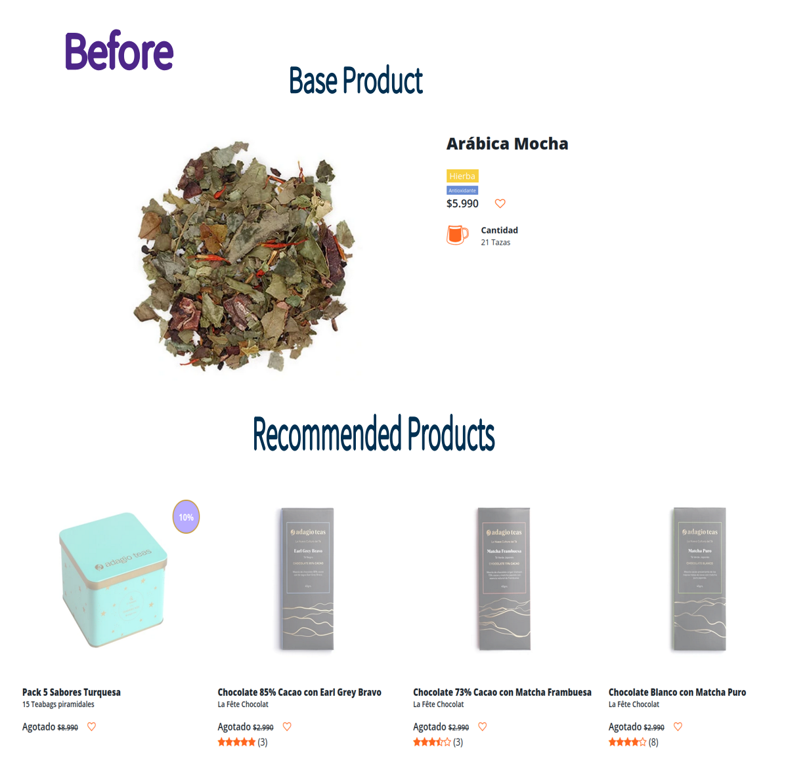
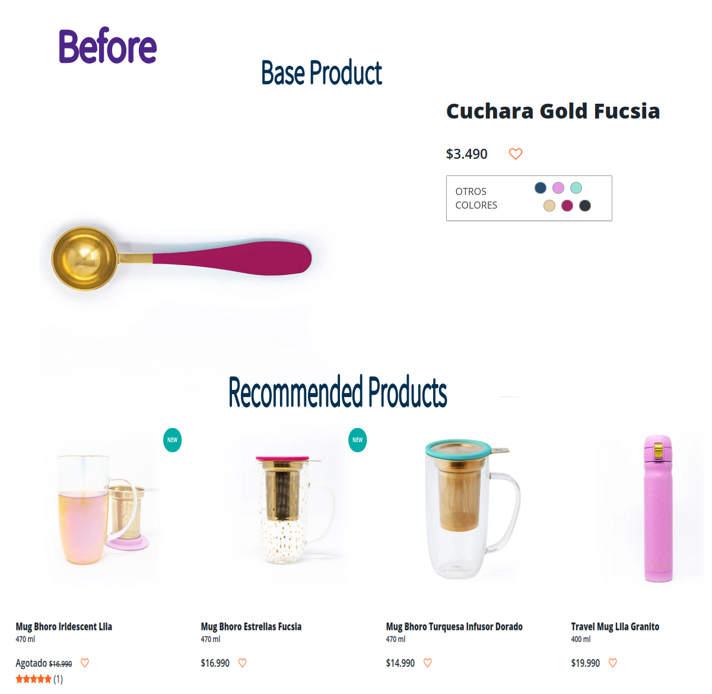
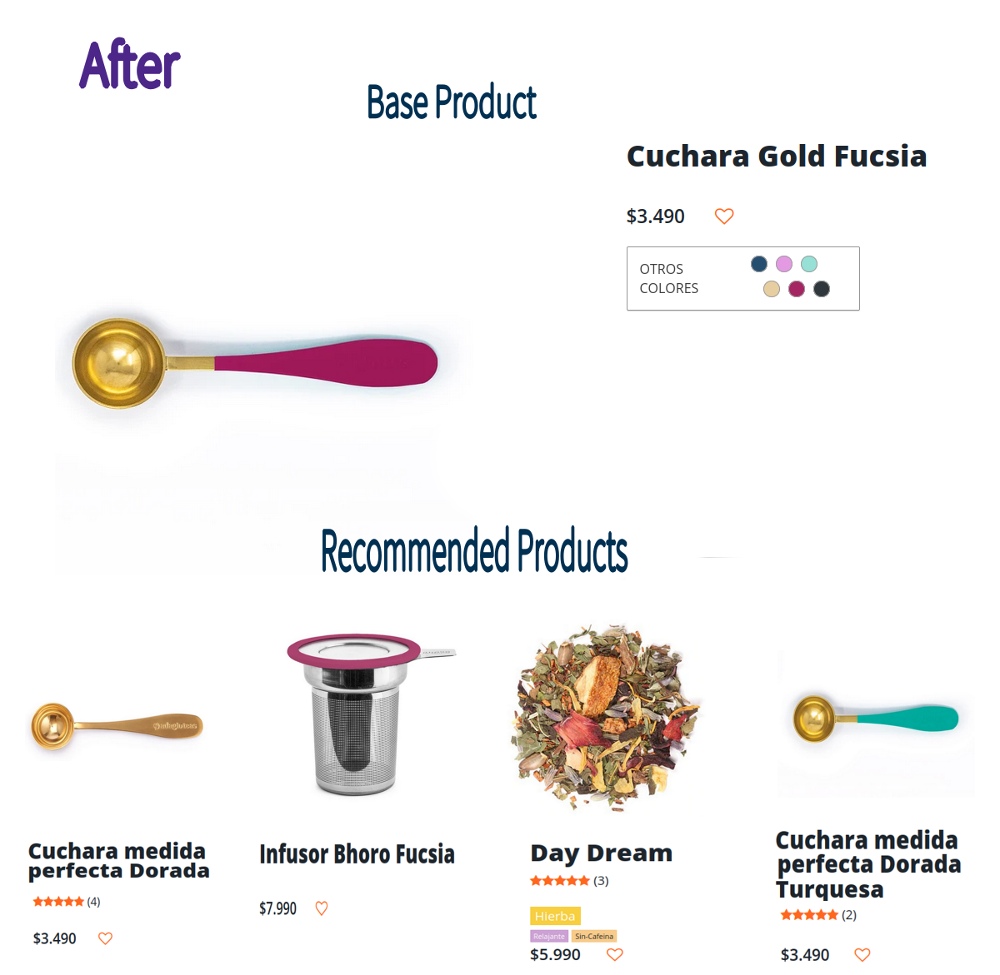

# Adagio Teas Recommendation System

One of the secrets of many internet services (Youtube, Netflix, Tiktok) is their recommendation system. **They want you to spend as much time as possible on their pages**. For that, they have designed algorithms that, without even having finished watching a video, they are already recommending you another (the case of Youtube).

**This idea can be translated to internet shopping websites**. To prevent the consumer from leaving. And to keep them looking for all product the page can offer.

That is what we have done in this project, with pretty good results.

## Requirements

The Python Notebook `recommendation_system.ipynb` was written in a Python 3.9 environment and using the following libraries:

- [NumPy](http://www.numpy.org/)
- [Pandas](http://pandas.pydata.org/)
- [Scikit-Learn](http://scikit-learn.org/stable/)

## Dataset

The data was scraped from the [Adagio website](https://adagio.cl/) using 

- [scrapy](https://scrapy.org/)

## Methodology

First we vectorized each of the following variables extracted from data:

- Product description,
- Product rating,
- Product labels,
- Availability.

to be presented as vectors.

Next we defined a way to measure similarities. Calculating the cosine of the angle formed by two vectors. As low angles means similar direction vectors. After we gathered this information into square matrices.

Finally, we summed the four matrices to pass them through a selection algorithm.

## Results

We obtained a working recommendation system: 

3 of 4 total recommendations are chosen taking into account the above variables. 
And the last recommendation is chosen completely at random, only taking into account the Availability. The latter because there are so many events in life, that no formula can model it perfectly. And we have to make room for randomness.

## Examples

Example 1:

 

 

**Here, 4 Pomos Flavour Explotion is the random recommendation.**

Example 2:

 

 

**Here, Day Dream is the random recommendation.**

## Support

Give a :star: if you like it :hugs:.
